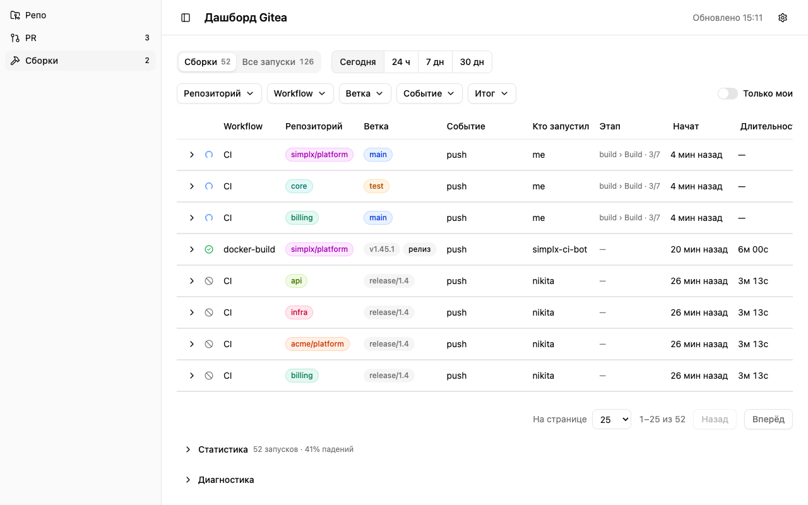
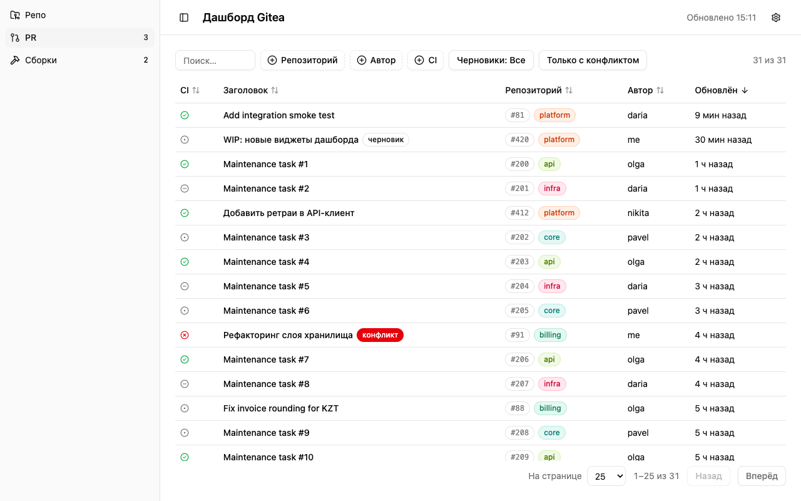
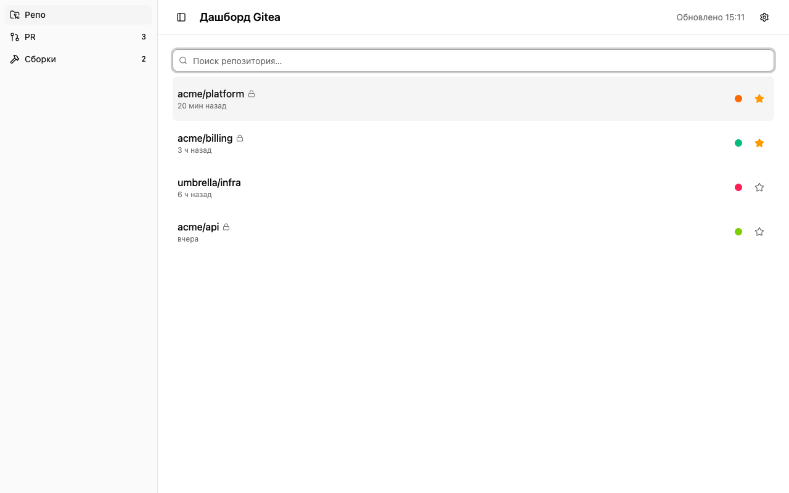
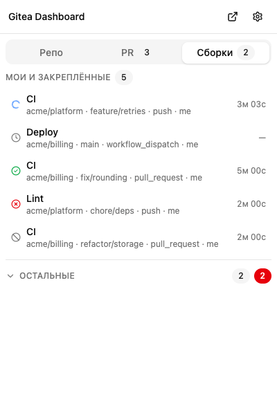

# Gitea Dashboard

Расширение для Chrome (Manifest V3): панель для нашего self-hosted Gitea
(`git.sadmin.app`) — репозитории, пул-реквесты, которые ждут вашего внимания,
и статусы сборок Actions. Работает только на чтение (`GET`), без своего
сервера: все запросы идут напрямую из расширения в ваш Gitea по личному
токену.

## Установка (сборка из исходников)

Расширение живёт в `simplx-toolkit` (`packages/gitea-dashboard`). Готовых
сборок нет — каждый собирает его у себя и ставит как распакованное.

Нужно: Node.js 20+ и pnpm (`corepack enable` или `brew install pnpm`).

```bash
git clone https://git.sadmin.app/simplx/simplx-toolkit.git
cd simplx-toolkit/packages/gitea-dashboard
pnpm install --frozen-lockfile
pnpm build            # результат — папка .output/chrome-mv3
```

Затем в Chrome:

1. Откройте `chrome://extensions`.
2. Включите **«Режим разработчика»** (правый верхний угол).
3. Нажмите **«Загрузить распакованное расширение»** и укажите папку
   `simplx-toolkit/packages/gitea-dashboard/.output/chrome-mv3`
   (в ней лежит `manifest.json`). Папку не перемещайте — Chrome читает её
   постоянно.
4. Значок появится на панели инструментов — при первом запуске откройте
   настройки (см. ниже «Первичная настройка»).

### Обновление

```bash
cd simplx-toolkit && git pull
cd packages/gitea-dashboard && pnpm install --frozen-lockfile && pnpm build
```

После сборки на `chrome://extensions` нажмите ⟳ на карточке расширения и
перезагрузите открытые вкладки дашборда. Настройки, токен и закреплённые
репозитории хранятся в `chrome.storage` браузера и при пересборке не
теряются.

## Создание токена доступа

Токен создаётся в вашем Gitea:

```
<адрес_gitea>/user/settings/applications
```

например `https://git.sadmin.app/user/settings/applications` → раздел
«Управление токенами доступа» → «Создать новый токен».

Токену нужны **ровно эти права** (не больше — принцип минимальных
привилегий, FR-002):

| Право | Зачем |
|---|---|
| `read:repository` | список репозиториев, пул-реквесты, статусы CI, запуски Actions |
| `read:issue` | поиск PR, ожидающих ревью/созданных вами |
| `read:user` | данные текущего пользователя (логин, id) |
| `read:organization` | список организаций и их сборки |
| `read:notification` | уведомления Gitea (для дедупликации и раздела уведомлений) |

Скопируйте токен сразу после создания — Gitea показывает его один раз.

## Первичная настройка

1. Откройте настройки расширения (правый клик по значку → «Параметры», либо
   через `chrome://extensions` → «Сведения» → «Параметры расширения»).
2. В разделе **«Подключение»**:
   - укажите **адрес** вашего Gitea (по умолчанию подставлен
     `https://git.sadmin.app`, можно изменить);
   - вставьте созданный **токен**;
   - нажмите **«Сохранить»** — браузер спросит разрешение на доступ к адресу
     инстанса (`<origin>/*`) — **разрешите доступ**, иначе запросы к Gitea
     будут блокироваться (расширение по умолчанию не имеет доступа ни к
     одному сайту, FR-004);
   - нажмите **«Проверить подключение»**, чтобы увидеть диагностику: логин,
     версию Gitea, режим сборок (по организациям/по репозиториям/не
     поддерживаются) или точную причину ошибки (неверный токен, недостающее
     право, адрес не похож на Gitea и т.д.).

## Разделы окна

Окно (400 px) открывается по клику на значок или `Alt+G`, содержит три
вкладки (переключение `Alt+1`…`Alt+3`):

- **Репо** — поиск по репозиториям (автофокус в поле, дебаунс 200 мс),
  закреплённые репозитории сверху списка, приватные помечены значком замка,
  относительное время последнего обновления.
- **PR** — ваши пул-реквесты сгруппированы:
  - **Ревью** — PR, где запрошено ваше ревью;
  - **Мои** — PR, которые создали вы;
  - **Остальные** — открытые PR по вашим организациям/репозиториям (можно
    отключить в настройках), кроме уже показанных выше.
  Для каждого PR — статус CI, пометки «черновик» и «конфликт», ссылка
  «ещё N» на список в самом Gitea, если сервер вернул больше, чем показано.
- **Сборки** — запуски Gitea Actions двумя группами:
  - **«Мои и закреплённые»** — развёрнута по умолчанию: ваши запуски и
    запуски закреплённых репозиториев;
  - **«Остальные»** — свёрнута по умолчанию, со счётчиком активных и
    упавших запусков; можно развернуть.
  Для активного запуска длительность обновляется раз в секунду.

## Страница во вкладке

Помимо окна (400 px) есть полноразмерная страница `dashboard.html` — те же
данные и та же логика (общий снимок, общие настройки), но в широкой
раскладке вкладки браузера, с таблицей PR и историей сборок за период.

**Как открыть**: кнопка со значком внешней ссылки в шапке окна (рядом с
шестерёнкой настроек) открывает текущий раздел на отдельной вкладке и
закрывает окно. Повторное нажатие (из любого окна расширения) не плодит
вкладки — если страница уже открыта в каком-то окне браузера, расширение
переключается на неё и делает её окно активным, а не создаёт новую.

**Что на странице**:

- **Разделы** — те же «Репо» / «PR» / «Сборки», что и в окне: слева
  колонка навигации при ширине ≥1024 px (сворачивается в узкую полосу
  значков кнопкой в шапке или на краю самой колонки, состояние
  сохраняется между открытиями страницы), вкладки сверху на более узких
  экранах. Текущий раздел и его настройки хранятся в адресе страницы
  (`#/repos`, `#/prs`, `#/builds`) — обновление, история браузера
  (кнопки «назад»/«вперёд») и `Alt+1`…`Alt+3` работают как в окне.

  

- **Тэги репозитория/ветки/номера** — в таблице PR и в истории сборок
  репозиторий, ветка и номер PR показаны цветными тэгами вместо голого
  текста: репозиторий — короткое имя без владельца (полное `owner/repo`
  показывается только при совпадении имени с другим репозиторием другого
  владельца — тогда тэг показывает `owner/repo` целиком, чтобы не
  перепутать), ветка — синим для `main`/`master`, янтарным для `test`,
  нейтральным для остальных, номер PR — приглушённым моноширинным `#42`.

- **PR — вид «Таблица»** — переключатель «Группы / Таблица» рядом с
  разделом PR открывает построчную таблицу со фасетными фильтрами
  (репозиторий, автор, статус CI, группа, черновики, конфликты), поиском
  по заголовку/репозиторию/автору/номеру и сортировкой по любой колонке.
  Все фильтры и сортировка сохраняются в адресе страницы — ссылку с
  готовым фильтром можно отправить коллеге.

  

- **Сборки — вид «История»** — переключатель «Группы / История» в разделе
  «Сборки» показывает запуски Actions за выбранный период (24 ч / 7 дн /
  30 дн) с фильтрами по репозиторию, workflow, ветке, событию, итогу и
  «только мои», карточками статистики (всего запусков, доля падений,
  средняя/медианная длительность) и таблицей запусков с подгрузкой
  «показать ещё» при неполном покрытии периода. Для выполняющихся
  запусков колонка «Этап» показывает текущий job/шаг (`build › Build ·
  3/7`); шеврон слева от строки разворачивает список всех jobs с их
  шагами и статусами — текущий шаг подсвечен.

  

  

- **Живое обновление** — пока вкладка открыта и видима, страница шлёт те
  же heartbeat-сообщения, что и окно, поэтому фоновый опрос ускоряется
  так же, как при открытом окне; после закрытия вкладки или переключения
  на другую страницу опрос возвращается к обычному интервалу.

## Клавиатура и omnibox

В окне (вкладка «Репо», если не указано иное):

| Клавиши | Действие |
|---|---|
| `Alt+G` | открыть/закрыть окно расширения |
| `Alt+1` / `Alt+2` / `Alt+3` | переключить вкладку (Репо / PR / Сборки) |
| `↑` / `↓` | перемещение по списку репозиториев |
| `Enter` | открыть репозиторий |
| `Cmd/Ctrl+Enter` | открыть вкладку «Pull Requests» репозитория |
| `Shift+Enter` | открыть вкладку «Actions» репозитория |
| `Cmd/Ctrl+P` | закрепить/открепить выделенный репозиторий |

В адресной строке Chrome: введите `gt` и пробел, затем часть названия
репозитория — появятся до 6 подсказок (сначала закреплённые, затем
результаты поиска). Enter по подсказке открывает репозиторий; Enter по
произвольному тексту — первую подсказку либо страницу поиска
`/explore/repos?q=` вашего Gitea, если подсказок нет.

## Бейдж на значке

Число на значке настраивается в «Опрос и бейдж»:

- **reviews** — сколько PR ждут вашего ревью;
- **builds** — сколько ваших сборок сейчас активно;
- **sum** — сумма обоих.

Бейдж становится **красным**, если одна из ваших сборок недавно упала (окно
задаётся настройкой «окно красного бейджа», по умолчанию 30 минут) — по
истечении окна цвет возвращается к нейтральному.

## Уведомления

Системное уведомление создаётся один раз на событие (падение сборки, успех
после падения, новый запрос на ревью, комментарий — по вашим настройкам
охвата), с дедупликацией по ключу события, чтобы не спамить повторно при
каждом цикле опроса и не создавать лавину уведомлений при первом запуске
(первый цикл только «засевает» список увиденного). Клик по уведомлению
открывает соответствующую страницу в Gitea.

## Безопасность

- Токен хранится **только локально**, в `chrome.storage.local` этого
  браузера — никуда, кроме вашего Gitea, не передаётся.
- Расширение выполняет **только `GET`-запросы** — ничего не создаёт, не
  меняет и не удаляет в Gitea (мутирующих запросов нет).
- Запросы уходят **только на origin вашего инстанса** — доступ к другим
  сайтам не запрашивается и не используется (host-разрешение
  `optional_host_permissions`, выдаётся явным жестом пользователя при
  сохранении настроек).
- Никакой телеметрии, аналитики или отправки данных на сторонние сервисы —
  весь код работает локально в браузере.

## Минимальная версия Gitea и деградация

Просмотр репозиториев, PR и уведомлений работает от любой достаточно новой
версии API v1. Раздел **сборок** (Gitea Actions) требует **Gitea ≥ 1.25**.
Если сервер старше или Actions недоступны:

- при проверке подключения это видно сразу (диагностика покажет режим
  сборок как неподдерживаемый);
- вкладка «Сборки» вместо списка показывает соответствующее пояснение,
  остальные вкладки (Репо, PR) продолжают работать в обычном режиме.

Если у токена нет права `read:organization`, расширение переходит в
запасной режим сборок — по отдельным репозиториям (закреплённым и своим)
вместо запроса по организациям целиком.

## Оценка нагрузки на сервер

По расчёту (`docs/specs/001-gitea-dashboard/research.md`, R10) и подтверждено
тестом бюджета (`tests/integration/poller-runs.test.ts`):

- на каждую организацию — 3 запроса за базовый цикл (активные / последние /
  мои запуски, эндпоинты A10+A11+A15) и 2 запроса за быстрый цикл
  (активные + мои, без «последних»);
- по 1 запросу за цикл на **каждый закреплённый репозиторий** — независимо
  от того, покрыт ли уже он организацией (эндпоинт A12): поток чужих
  запусков на странице организации не должен вытеснять сборки закреплённого
  репозитория (research R4, `src/domain/scope.ts` `addPinnedRepoSource`) —
  это правило действует и в базовом, и в быстром цикле;
- по 1 запросу за цикл (**только в базовом цикле**) на каждый ваш
  собственный репозиторий с Actions и на каждый репозиторий из
  `includeRepos`, но только если их владелец **не** покрыт уже
  опрашиваемой организацией (`addExtraRepoSource`);
- список собственных репозиториев (A4) запрашивается не каждый цикл, а раз
  в час — плюс раз в сутки данные о себе, раз в час — список организаций;
- запросы по PR: 2 (ревью + мои) + 1 на организацию + 1 на себя за цикл
  (эндпоинты A5–A7), плюс запрос списка PR репозитория (A8) и статуса
  коммита (A9) — **только если что-то изменилось** (новый `updated_at` PR,
  новый sha или предыдущий статус ещё не финальный).

**SC-009** (spec.md) задаёт лимит не «за цикл», а в запросах в минуту на
одного разработчика при базовом интервале: **≤ 20/мин** при опросе одной
организации, **≤ 40/мин** при трёх, **≤ 45/мин** в запасном режиме по
репозиториям (30 репозиториев, режим `repo` при отсутствии
`read:organization`).

Фактический замер (тест «budget» в `poller-runs.test.ts`, 3 организации + 5
закреплённых репозиториев + 5 собственных репозиториев вне этих
организаций): ровно **19** запросов к спискам запусков
(`.../actions/runs`) за один базовый цикл, плюс 1 запрос списка своих
репозиториев (раз в час, не каждый цикл).

Ниже — расчётные запросы в минуту при **базовом цикле** (60 с), отдельно по
секциям и итогом, при до 5 закреплённых репозиториях и до 5 собственных
репозиториях вне охваченных организаций (та же конфигурация, что и в тесте
бюджета):

| Организаций | Сборки: `3×орг + 5 закреп. + 5 своих` | PR: `2 + (орг + 1)` | Итого за 60 с ≈ запросов/мин | Потолок SC-009 |
|---|---|---|---|---|
| 1 | 3 + 5 + 5 = 13 | 2 + (1 + 1) = 4 | 13 + 4 = **17/мин** | ≤ 20/мин |
| 3 | 9 + 5 + 5 = 19 | 2 + (3 + 1) = 6 | 19 + 6 = **25/мин** | ≤ 40/мин |

(A8/A9 — списки PR репозитория и статусы коммитов — не входят в этот
расчёт: они уходят только при изменении, а не каждый цикл.) В **быстром**
цикле (30 с, включается при активных «моих» сборках) PR не опрашиваются,
только сборки: `2×орг + 5 закреп.` — 7 запросов/30 с ≈ 14/мин для 1
организации, 11 запросов/30 с ≈ 22/мин для 3. При открытом окне частота
сборок дополнительно растёт до 15–20 с (пока окно шлёт
`popup-heartbeat`), после закрытия окна возвращается к базовому/быстрому
режиму. Запасной режим по репозиториям (`actions='repo'`, до
`repoModeLimit` = 30 репозиториев) укладывается в отдельный потолок
SC-009 ≤ 45/мин.

Приведённые числа — расчёт по коду и модельным сценариям теста; фактический
замер на живом инстансе (`git.sadmin.app`) появится в `docs/acceptance.md`
после приёмки T062 и будет добавлен сюда отдельной строкой.

## Скриншоты

| | |
|---|---|
|  |  |
|  |  |

Спецификации и решения: `docs/specs/001-gitea-dashboard/` (окно, опрос,
уведомления) и `docs/specs/002-fullpage-dashboard/` (страница во вкладке).

## Разработка

Стек: TypeScript (strict), WXT 0.21 (`srcDir: 'src'`), React 19
(`@wxt-dev/module-react`), shadcn/ui + Tailwind v4, Vitest + `WxtVitest()` +
`fakeBrowser`. Только `pnpm` (не npm/yarn).

```bash
pnpm install     # установка зависимостей
pnpm dev         # dev-режим WXT (hot reload)
pnpm build       # сборка в .output/chrome-mv3
pnpm zip         # сборка + упаковка в .output/*-chrome.zip
pnpm screenshots # dev-only: сборка + скриншоты окна/настроек в docs/screenshots
```

### Тесты и проверка типов

`pnpm test` / `pnpm typecheck` в этом окружении оборачиваются pnpm-обвязкой,
которая может искажать вывод (маскировать упавшие тесты сообщением вида
«parser failed» или просто скрывать провал) — **не полагайтесь на эти
команды для проверки результата**. Запускайте бинарники напрямую:

```bash
./node_modules/.bin/vitest run                 # все тесты
./node_modules/.bin/vitest run tests/unit/foo.test.ts   # один файл
./node_modules/.bin/wxt prepare && ./node_modules/.bin/tsc --noEmit  # типы
```

Всегда проверяйте код выхода (`echo EXIT:$?`), а не только текст в
консоли.

### Проверка размера

```bash
node scripts/check-size.mjs
```

Проверяет, что бандл окна (JS+CSS, загружаемые `popup.html`, включая
статически подключаемые чанки) не превышает 400 КБ (SC-010, пересмотрено
для стека React 19 + shadcn/ui + Tailwind v4). Тот же скрипт запускается в
разработчиком перед PR.
